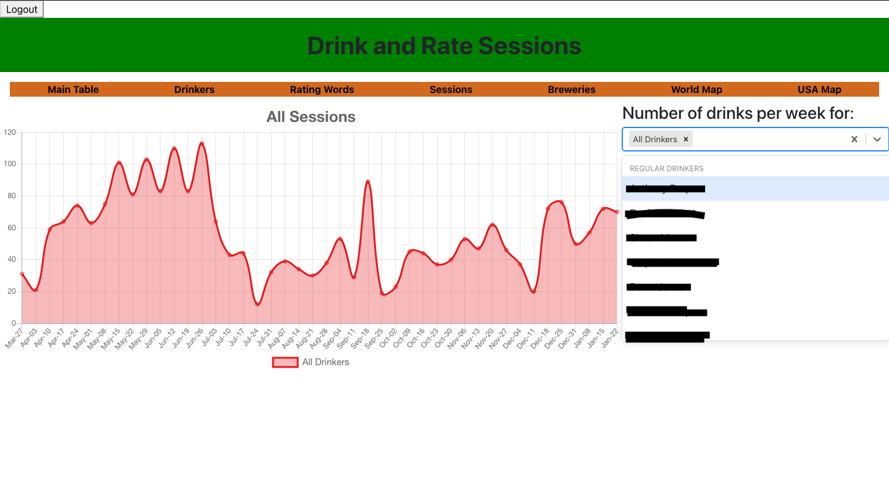

## Drink and Rate - React Front-end

This folder contains the react application where I computate and display the data sent via MongoDB/Mongoose/NodeJs. Each browser route is separated into its own folder branch, plus folders for auth0, stylesheets and my own utilities. Only the index.js and my custom hooks are in the main folder.

## Setup

For security the app comes with Auth0 securing all routes via index.js. The 'Auth0Provider' can either be removed or you can set up your own Auth0 account and a .env file where you can store your Auth0 Domain, Client_ID and Audience keys.

## Project Screenshots

As of 28/01/2021

- Here all drinks and be viewed and searched for

- Here data on each drinker can be viewed

- Here data on every rating word used can be seen

- By selected a word you can view how many times it has been said and who by. By selecting a chart segment you can see just that person's drinks described by that word.

- Here you can see drink numbers for each gathering.

- Here you can search for and see ratings pertaining to each individual brewery, cidery or distillary.

- Here you can see data relating to drinks drunk from the United States, choosing to limit them to just beers and ciders if preferred. Clicking each state reveals drinks drunk from that state along with data on individuals who have had drinks from that state.